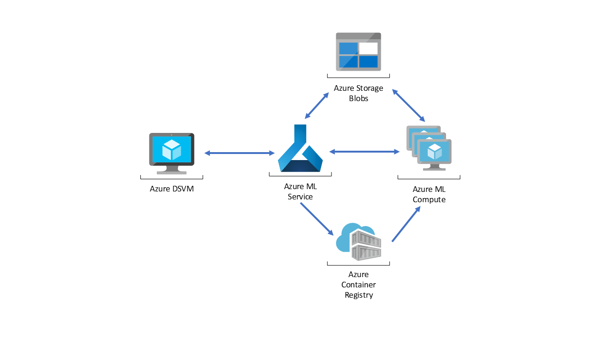

### Author: Mario Bourgoin

# Tuning Python models on a Batch AI cluster

## Overview
This scenario shows how to tune a Frequently Asked Questions (FAQ) matching model that can be deployed as a web service to provide predictions for user questions. For this scenario, “Input Data” in the architecture diagram refers to text strings containing the user questions to match with a list of FAQs. The scenario is designed for the Scikit-Learn machine learning library for Python but can be generalized to any scenario that uses Python models to make real-time predictions.

## Design

The scenario uses a subset of Stack Overflow question data which includes original questions tagged as JavaScript, their duplicate questions, and their answers. It tunes a Scikit-Learn pipeline to predict the match probability of a duplicate question with each of the original questions. The application flow for this architecture is as follows:
1. 

## Prerequisites
1. Linux(Ubuntu).
2. [Anaconda Python](https://www.anaconda.com/download)
3. [Docker](https://docs.docker.com/v17.12/install/linux/docker-ee/ubuntu) installed.
4. [DockerHub](https://hub.docker.com/) account.
5. [Azure account](https://azure.microsoft.com).

The tutorial was developed on an [Azure Ubuntu
DSVM](https://docs.microsoft.com/en-us/azure/machine-learning/data-science-virtual-machine/dsvm-ubuntu-intro),
which addresses the first three prerequisites.

## Setup

To set up your environment to run these notebooks, please follow these
steps.  They setup the notebooks to use Docker and Azure seamlessly.

1. Create a _Linux_ DSVM.
2. In a bash shell on the DSVM, add your login to the `docker` group:
   ```
   sudo usermod -a -G docker <login>
   ```
3. Login to your DockerHub account:
   ```
   docker login
   ```
4. Clone, fork, or download the zip file for this repository:
   ```
   git clone https://github.com/Azure/MLBatchAIHyperparameterTuning.git
   ```
5. Create the Python MLBatchAIHyperparameterTuning virtual environment using the environment.yml:
   ```
   conda env create -f environment.yml
   ```
6. Activate the virtual environment:
   ```
   source activate MLBatchAIHyperparameterTuning
   ```
7. Login to Azure:
   ```
   az login
   ```
8. If you have more than one Azure subscription, select it:
   ```
   az account set --subscription <Your Azure Subscription>
   ```
9. Start the Jupyter notebook server in the virtual environment:
   ```
   jupyter notebook
   ```

## Steps
After following the setup instructions above, run the Jupyter notebooks in order starting with [Data Prep Notebook](https://github.com/Azure/MLBatchAIHyperparameterTuning/blob/master/00_Data_Prep.ipynb).

## Cleaning up
To remove the conda environment created see [here](https://conda.io/docs/commands/env/conda-env-remove.html). The last Jupyter notebook also gives details on deleting Azure resources associated with this repository.

# Contributing

This project welcomes contributions and suggestions.  Most contributions require you to agree to a Contributor License Agreement (CLA) declaring that you have the right to, and actually do, grant us the rights to use your contribution. For details, visit https://cla.microsoft.com.

When you submit a pull request, a CLA-bot will automatically determine whether you need to provide a CLA and decorate the PR appropriately (e.g., label, comment). Simply follow the instructions provided by the bot. You will only need to do this once across all repos using our CLA.

This project has adopted the [Microsoft Open Source Code of Conduct](https://opensource.microsoft.com/codeofconduct/). For more information see the [Code of Conduct FAQ](https://opensource.microsoft.com/codeofconduct/faq/) or contact [opencode@microsoft.com](mailto:opencode@microsoft.com) with any additional questions or comments.
